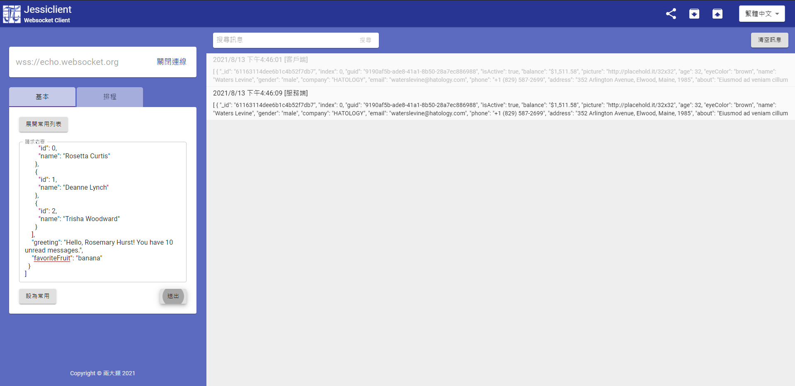
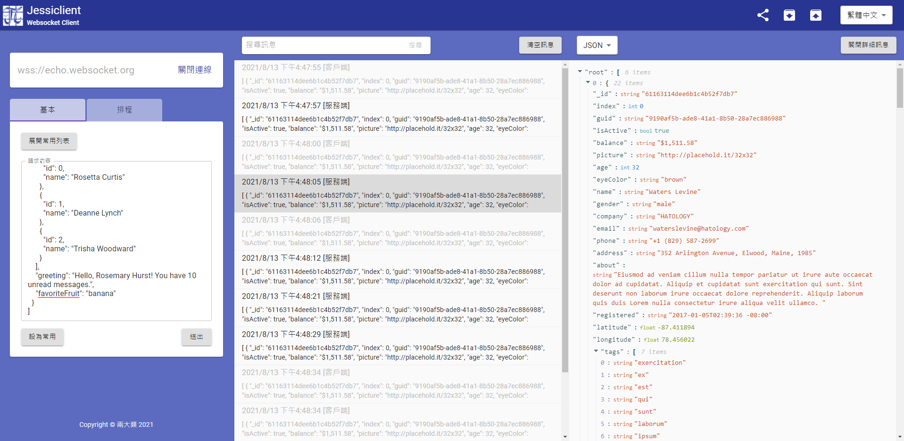
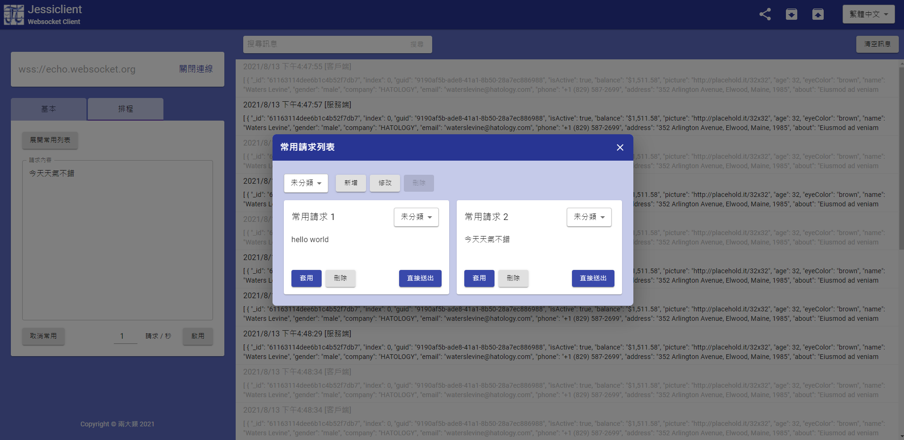
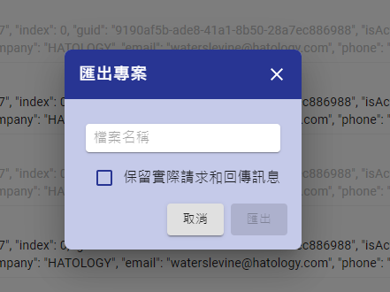
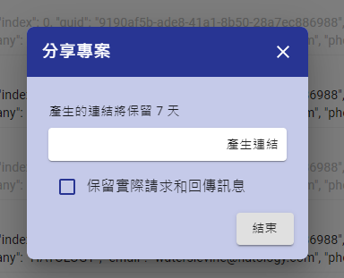
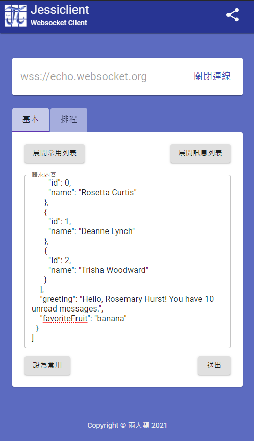
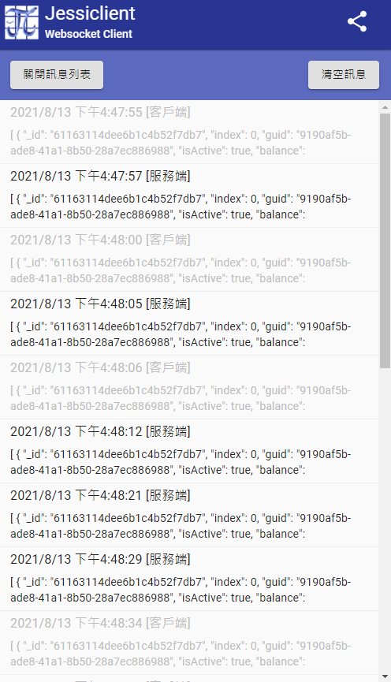
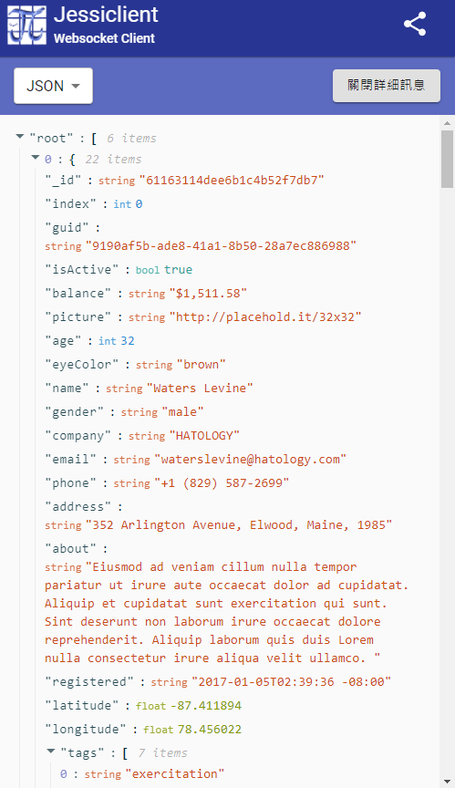

# jessiclient

網站連結： https://jessiclient.marco79423.net

功能特色：

* 美觀的介面：精心設計的介面，並且可以正常在手機使用，同時支援英文、繁中和簡中三種語言
* 手機模式：可以正常在手機上使用 Jessiclient
* 排程模式：可以啟用定時傳送訊息的功能
* 專案匯出匯入和分享：可以透過匯出檔案或是分享連結的方式分享專案的內容

## 螢幕截圖

桌面顯示

桌面顯示 (顯示詳細)

常用請求功能

匯出專案

分享專案

手機模式

手機模式 (訊息列表)

手機模式 (詳細訊息)

## 程式架構

    frontend/               # 前端
        page/
            index.js        # 頁面進入點
        features/           # 各項功能提供的 Provider 和 Hook
        store/              # Redux 的 Store
        redux/              # Redux 相關的 Actions 和 Selectors
        components/
            app/            # 應用本體的組件
            elements/       # 基本組件
            hooks/          # 通用的 Hook
            themes/         # 主題相關設定
        utils/              # 工具包

    backend/                # 後端
        main.py             # 後端程式進入點
